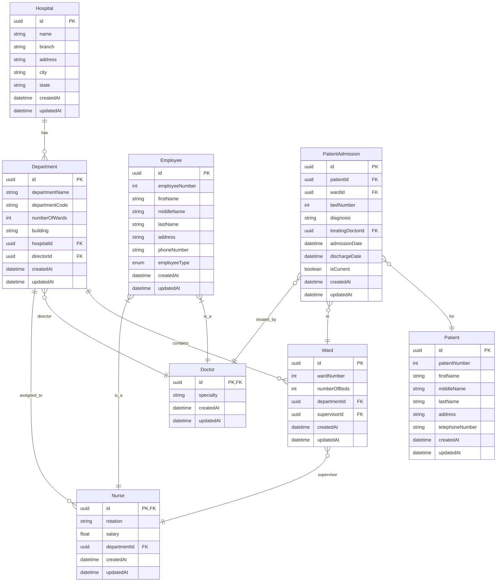

# Hospital Information System


*(Replace with actual ERD image)*


## Project Overview

This project implements a comprehensive Hospital Information System database with Java JDBC connectivity. The system models hospital operations including employee management, department/ward organization, and patient care tracking.

## Key Features

- **Relational Database Design**: Properly normalized schema up to 3NF
- **JDBC Connectivity**: Secure Java database connection
- **CRUD Operations**: Full Create, Read, Update, Delete functionality
- **Entity Relationships**: Models complex hospital organizational structure

## Database Schema

### Main Entities

- **Employees** (Doctors and Nurses)
- **Departments** (with director doctors)
- **Wards** (with supervising nurses)
- **Patients** (with hospitalization details)

### Relationships

- One-to-many: Department → Wards
- Many-to-one: Nurse → Department
- Many-to-many: Doctors ↔ Patients (through treatments)

## Technologies Used

- Database: MySQL/PostgreSQL
- Backend: Java JDBC
- Modeling Tool: *(Specify your ERD tool here)*

## Getting Started

### Prerequisites

- Java JDK 8+
- MySQL/PostgreSQL installed
- JDBC driver

### Installation

1. Clone the repository:
   ```bash
   git clone https://github.com/thenoblet/hms.git
   ```

2. Import the SQL schema:
   ```bash
   mysql -u username -p < hospital_schema.sql
   ```

3. Configure database connection in `src/main/java/gtp/hms/util/DatabaseConnection.java`


### Sample CRUD Operations


## ERD Diagram

*(Include your actual ERD diagram here or link to image)*


